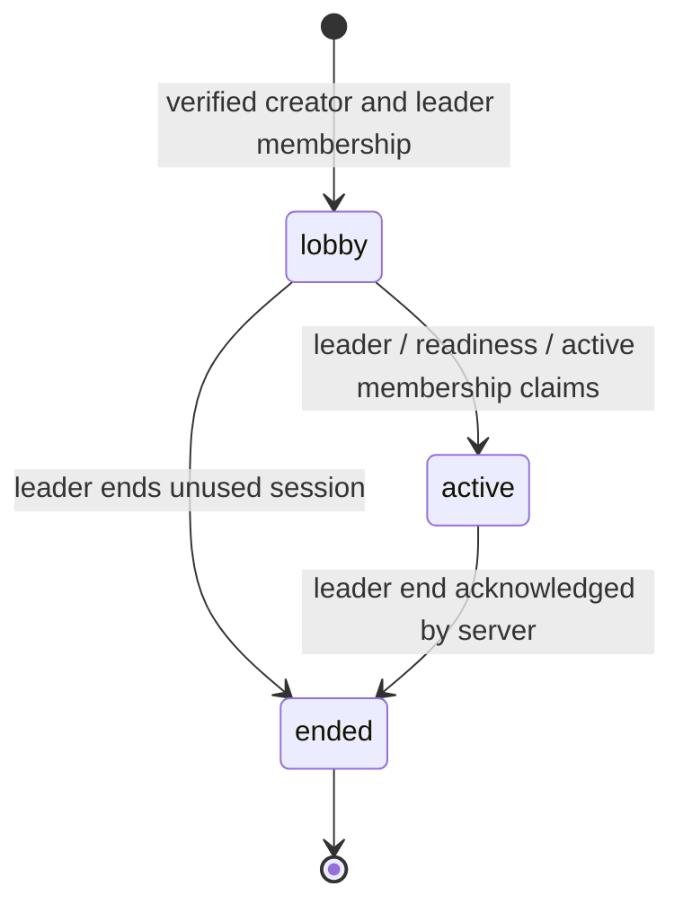

# Access, lifecycle and privacy rules

This applies the [Day 1 baseline](../day-01/scope-and-decisions.md) to server transactions. It specifies implementation requirements; it is not evidence that guards, storage policies or background workers already run.

## Authorization matrix

| Resource / command | Required actor and state | Deny / side effects |
|---|---|---|
| Profile, device session, emergency contact | Account owner; valid session | Pair, leader and external viewer receive no private contact access |
| Invite preview / join | Verified account; valid invitation; explicit join; lobby/active | Return minimal preview only; no member list/coordinates; capacity and active-ride conflicts are transactional |
| Current ride, route, map, chat, events | Current member; lobby/active as applicable | Former member loses live reads/writes/subscriptions immediately |
| History / own summary | Participated member, ended ride, unexpired retention | No unrelated ride reads; departed members retain only permitted historical participation access |
| Start / end / invite rotation / thresholds | Current leader; valid lifecycle and stationary context where required | Exactly one authority source; no client role field grants authority |
| Role change / leadership transfer | Leader proposal plus affected member acceptance | Target must be rider before leadership acceptance; no automatic transfer on disconnect |
| Pair / unpair / readiness | Same-ride motorcycle rider + pillion; own consent; stationary | Pillion attests own helmet/readiness; neither leader nor rider can attest for them |
| Rest-stop headcount | Stationary leader; active ride; fresh round/current pair set | Duplicate scan counts once; changed pairs invalidate affected confirmations |
| Samples | Current active member, owned device, current sharing-consent epoch | Never infer opt-in from joining; reject current writes after stop/leave/end |
| Text / pin / voice / photo / scan | Authorized actor and stationary context | Moving/unknown active-ride state blocks composition; no need to restart GPS just to use permitted stationary controls |
| Preset / manual SOS | Any current active member | No stationary, GPS, map-provider, entitlement or pairing prerequisite |
| Status link create / revoke | Owner of the shared status; create requires active sharing | External viewer cannot create, revoke, write or discover private resources |
| Media download | Authorized current/participated member for resource state; unexpired media | Quarantined/unvalidated uploads never served; reauthorize on every proxy read |
| Account/data deletion | Owner, freshly confirmed session for destructive account request | Block sessions/sharing immediately; clean contributed data and anonymize shared references |

For hidden cross-ride resources, use the same not-found response as nonexistent IDs. Validate request shape before domain execution, then current identity, authorization, state and concurrency revision. Do not disclose another rider's coordinates in validation errors. Rate limiting must distinguish abuse from an ordinary safety send; normal SOS cannot queue behind route/media processing.

## Ride and membership transitions

`end_pending`, `leave_pending`, offline and disconnected are client delivery states, not additional server ride states. `sharing=false` is independent of membership. Local stop takes effect immediately, even if the server is unreachable.

| Operation | Lock/check contract | Atomic outcome |
|---|---|---|
| Create | Account active; valid 1–80 character name and transport | Lobby + creator membership + leader pointer + invite + command receipt |
| Join | Lock ride; valid invitation; current count <50; account has no other active ride if target active | One current membership; active claim if active; sharing off; no automatic pair |
| Start | Lock ride then affected accounts in sorted ID order; leader; all current pairs ready; no competing active claims | State active, started time, one active claim per current member, revision and outbox event |
| End | Lock ride; current leader; idempotent retry | State ended/end time; clear active claims and pairs; revoke links; stop sharing; outbox and summary job once |
| Leave | Lock ride/member/account; leader transfers or ends first | Set participation end; remove active claim/pair/readiness; revoke owner links and live access |
| Transfer | Lock ride/current and target members; accepted consent; target physical role rider | Replace leader pointer; previous leader becomes API role rider; preserve valid motorcycle pair |
| Pair / unpair | Lock ride and affected members in stable order; same ride/roles/consent; stationary | Pair and both occupancy claims together; fresh readiness; unilateral own unpair clears both claims |
| Complete headcount | Lock ride/round and compare current pairing revision | Every current pair has a fresh acknowledged confirmation; complete once, else conflict/pending |
| Sharing stop / restart | Lock membership; stop revokes links; restart requires explicit permission/consent | Increment consent epoch; old buffered live samples cannot restore a stopped/restarted stream |

All multi-row commands use the same lock order: ride → relevant profiles sorted by ID → memberships → pairs/rounds. Cross-ride start races meet on profiles and unique active claims; one transaction wins, the other rolls back wholly. Never hold a database lock while waiting for a user, a network call or a scan. Consent is a stored, expiring proposal followed by a separate acceptance transaction. Retry deadlocks/serialization failures using the same command ID.

The schema's foreign keys and unique constraints are safeguards, not a complete implementation of this table. Day 7 transaction tests must exercise concurrent 50th/51st joins, competing starts, transfer/end, leave/pair and headcount membership changes. A raw SQL insert is not a supported application operation.

## Sharing and ordering

Membership records track consent epochs. A live sample belongs to a device, membership, consent epoch and capture timestamp. The backend resolves its authenticated owner, validates the epoch, rejects non-finite/out-of-range coordinates and never replaces newer live state with an older capture. Poor-accuracy samples may be retained as labelled history; age >30 seconds or accuracy >50 m excludes proximity calculations. Separate pillion samples never silently move the rider marker.

History uploads after end require proof of a previously granted consent epoch and capture before the earliest applicable local stop, leave or server end. A stopped stream can upload eligible history only to the historical route; it cannot update live markers or a public status link. Client time is untrusted: bound clock skew, retain received time, and flag uncertain histories rather than fabricating freshness. The bounded skew policy and device proof are Day 9 acceptance inputs.

App movement gating follows Day 1 hysteresis (>6 km/h for 5 seconds; <3 km/h for 10 seconds to exit). Server validation checks a fresh authenticated movement observation against available own telemetry; it is a defense against accidental/UI bypass, not proof that a device is physically stationary. Do not claim that client-reported sensor state prevents a malicious client from lying. Offline actions are revalidated when submitted. Unknown speed outside an active ride must not block ordinary account/permission onboarding.

## Status links

Generate 256 random bits on the server (exceeding the 128-bit minimum), encode for a bearer link, and store only its SHA-256 hash. Default lifetime is four hours; allowed choices are 1/4/8/24. Return the raw token once, never put it in command receipts/outbox/logs, and do not store it in browser persistence. A retry with a lost creation response returns existing link metadata with `tokenAvailable=false`; the owner can revoke it and explicitly create a replacement with a new command ID. This avoids persisting a recoverable bearer secret or silently creating duplicate links.

The browser landing URL carries the token in its fragment, removes it from the address bar after reading, and sends it only in an authorization header to a dedicated status endpoint. This reduces server/referrer log exposure; the bearer can still be copied by its holder. Use no third-party analytics, a restrictive content policy, `Referrer-Policy: no-referrer`, and `Cache-Control: no-store`. Do not place private ride endpoints or write controls in the viewer.

Every read checks the token hash, owner sharing/current membership, active account and ride, revocation and expiry. Response allowlist: owner's display name, ride state, own last position/freshness, own SOS state, server time and display-lease expiry. Never use a generic member serializer or paired marker response. No other member IDs, pairing names, contacts, messages, photos or history are allowed.

Grant a display lease of at most 15 seconds, capped by absolute expiry; renew every 5 seconds. The viewer clears on rejection, absolute expiry or lease expiry without renewal. Calculate the local lease conservatively using request-start monotonic time, recheck before rendering after background suspension, and never extend it using a stale cached response. Loss of connection is not permission for indefinite display.

Online stop/leave/end/revoke denies subsequent reads immediately. Offline actions stop local tracking as applicable and show revocation pending until the server receives them; previously delivered display leases last at most their existing bound. The browser cannot make a previously captured screenshot disappear. The design promises current authorization and bounded display, not erasure from a recipient's memory.

## Retention, deletion and secrets

| Data | Lifetime / deletion rule | Worker / enforcement |
|---|---|---|
| Precise samples, routes, chat/voice/photos and derived summaries/events with personal data | 90 days after ride end for all beta entitlements | Read-time expiry plus scheduled purge of DB, object files, projections/outbox copies and caches |
| Profile and private emergency contact | Until owner edit/delete/account deletion | Owner authorization; encrypted contact payload; no logs or pair access |
| Invites / consent proposals | Invite ≤24h/rotation/end; pairing QR single-use ≤5 min | Check expiry on every acceptance; do not rely on eventual cleanup |
| Status bearer | Earliest selected lifetime, server stop/leave/end/revoke/account block | Hash lookup and read-time check; short viewer lease |
| Sessions and links after deletion request | Revoke/block immediately | Persist a deletion tombstone before asynchronous cleanup; eject sockets |
| Own contributed active-store data | Remove within 7 days of deletion request | Retryable deletion job including storage objects, history, summaries and shared snapshots |
| Applicable backups | Expire within 30 days | Verify provider backup policy; restoration reapplies tombstones before exposing service |
| Device queue | At most 24 hours / 50 MB; clear private cache on account switch/deletion | Encrypted persistence, visible capacity/expiry warnings; no silent unacknowledged loss |

For an active ride, retention has not started counting from end yet. Do not invent a maximum ride duration; monitor abnormally long sessions for an explicit product decision. Delete/anonymize the requesting member's contributions while preserving permitted records belonging to other participants. Recompute summaries that depended on removed samples. Do not copy unbounded precise payloads into diagnostics or permanent audit logs.

Deletion of a leader ends every non-ended ride they lead, including Lobby sessions, transactionally before removing leader identity; it does not silently appoint another member. This is a Day 3 consistency decision to preserve one leader and immediate account deletion. Notify connected participants of the end. Historical leader/membership references become anonymized tombstones as needed, never retained private contacts or location.

Storage is private. Download/stream through a backend that rechecks access so a long-lived signed URL cannot bypass an immediately revoked membership. Bound media bytes/duration and strip photo EXIF before promotion from quarantine. Backend encryption, keys, private policies, scheduled purges and restore behavior are Day 4/later implementation checks, not provider settings verified today.
