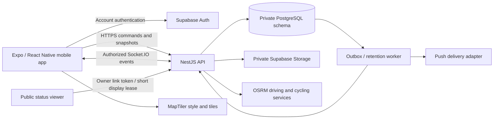

# Day 3 architecture decisions

This is the architecture baseline for implementation, not an installed application. It follows the [Day 1 decisions](../day-01/scope-and-decisions.md) and [Day 2 journeys](../day-02/journeys.md). Day 4 sets up the application and environments; Day 5 proves native compatibility and background location.

## System boundaries

Start with one backend codebase divided into modules: identity, rides/membership, routes, location, communication, pairing/check-ins, safety, sharing, media/history, and privacy. API and worker can run as separate processes from that codebase. A database transaction commits each durable change and its outbox event together. Socket.IO rooms and push are delivery mechanisms; PostgreSQL is authoritative. Do not introduce microservices or a broker before load or operational evidence justifies them.

The mobile app owns permission prompts, movement gating, immediate pending feedback, an encrypted local queue, and map rendering. It never owns group authorization or authoritative ride state. The public viewer is a separate small browser surface using only the owner-status projection. It cannot subscribe to private ride rooms.

## Stack selected for the foundation

| Area | Decision | Implementation checkpoint |
|---|---|---|
| Mobile | React Native, Expo development builds, TypeScript; Expo Router navigation | Day 4 setup; Day 5 minimum-OS/device proof |
| Backend | NestJS with TypeScript, REST `/v1`, Socket.IO for foreground updates | Day 4 application setup |
| Database | PostgreSQL with PostGIS planned for spatial queries; explicit SQL migrations and transactions | Day 4 migration tooling/extension availability |
| Authentication / files | Supabase Auth verified email/password; private Supabase Storage buckets; domain data through NestJS only | Days 4–5 identity, later media milestone |
| Maps | MapLibre React Native; MapTiler Cloud style/tile delivery selected | Day 5 native rendering and credential proof |
| Routing | Self-hosted OSRM, separately prepared driving and cycling datasets | Day 4 local containers, Days 5/8 profile checks |
| Device persistence | Platform secure storage for session/key material; encrypted SQLite queue/history | Day 5 native encryption feasibility, Days 9–15 queue implementation |
| Push | Backend adapter for Expo Push backed by APNs/FCM; minimal wake-up notification followed by authorized fetch | Day 19 delivery proof; provider credentials before device testing |
| Quality / operations | Existing design checks remain separate; app lint/type/build/tests and health/availability probes added with the apps | Day 4 |

Versions are deliberately not claimed compatible or installed today. Resolve the Expo/React Native/MapLibre combination together on Day 4 and prove iOS 16+ / Android 11+ on Day 5. MapLibre's current documentation requires React Native at least 0.80 and its v11 uses the new architecture. MapLibre requires a native rebuild and does not run in Expo Go. These constraints make a development build necessary. [MapLibre requirements](https://maplibre.org/maplibre-react-native/docs/setup/getting-started/), [Expo integration](https://maplibre.org/maplibre-react-native/docs/setup/expo/).

No SDK upgrade may silently raise the minimum OS. If encrypted local persistence or native location support cannot meet the baseline, record the conflict before the dependent feature work. Do not replace encrypted persistence with plain AsyncStorage to pass a setup check.

## Mapping and routing decision

Use a configurable MapTiler vector style with MapLibre. Keep required MapTiler/OpenStreetMap attribution visible in light and high-visibility modes. Public OSM tile servers and MapLibre demonstration tiles are not the beta tile backend; the public OSM service has its own usage policy and is not a guaranteed free production CDN. No offline map-pack download is included. [OSM tile policy](https://operations.osmfoundation.org/policies/tiles/).

Create separate tile keys per environment/application when accounts are configured. Treat keys embedded in mobile/web code as public identifiers, not secrets. Apply provider-supported restrictions, quotas, rotation and monitoring; verify that restrictions actually work in a native client before beta use. Never send ride trails, identities, contact data, or SOS payloads to the tile provider. Tile requests still reveal a requested map area; explain that in the privacy disclosure. [MapTiler key guidance](https://docs.maptiler.com/cloud/api/authentication-key/).

MapTiler's published free plan is for testing, personal or non-commercial use; third-party renderers consume tile API requests. A paid plan can incur overage, so do not infer that a commercial beta will be free. **Current authorized service spend is $0.** Use only existing/local test resources until a concrete plan and spending limit are approved. At the Day 4 configuration checkpoint record the account quota and alert at 50/80/95%; before a paid beta, set an owner-approved provider spending limit and test quota-exhaustion behavior. A map quota/outage leaves alerts and SOS reachable. No account, purchase, or paid plan was created for Day 3. [MapTiler pricing and limits](https://www.maptiler.com/cloud/pricing/).

OSRM is a private Docker deployment, initially local for a bounded synthetic/test region. Prepare **two datasets**, one with the driving Lua profile and one with the cycling profile; route the application's `driving` and `cycling` requests to the matching service. Merely changing the profile string against one prepared dataset does not switch its transport model. Motorcycle uses driving in this beta, with no claim of motorcycle-specific restrictions. OSRM coordinates are longitude/latitude; the API adapter converts explicitly from Ridr's named `lat`/`lon` fields. [OSRM API](https://project-osrm.org/docs/v5.24.0/api/).

Do not use the public OSRM demo as a production dependency. Backend-only routing access, bounded points/file size, request timeouts and per-user throttling protect the worker. No route is fabricated on `NoRoute` or an outage; keep a previously valid route. Version and hash the extract/profile used for each built dataset. The launch-region extract and hosting region remain Day 25 owner decisions; Pune in the wireframes is sample data. Measure both profile RAM/disk/build time before selecting a paid VM. No paid routing infrastructure is authorized today.

## Authentication and access architecture

Supabase handles password verification, email verification, refresh and recovery. NestJS validates signature, issuer, audience, expiration and the active session, then derives the actor from the verified subject. A valid JWT alone must not bypass a deleted account or revoked session. Check provider session status and the local account block on private requests and before real-time emission; disconnect invalid sessions. Use a request-scoped check rather than a long positive cache that hides revocation. Long-lived sockets must reauthenticate at expiry. Supabase notes that access JWTs can otherwise remain valid until expiry after sign-out. [Supabase sessions](https://supabase.com/docs/guides/auth/sessions).

The `ridr` schema is private, excluded from the Data API's exposed schemas, and has no `anon`, `authenticated`, or `PUBLIC` grants. A dedicated non-owner backend role receives only required operations; migration ownership is separate. The reference DDL revokes PUBLIC access but does not provision hosted roles. Day 4 must verify actual role grants, exposed schemas and private bucket policies. Supabase RLS protects exposed tables when direct APIs are used; no direct domain-table access is part of this design. [Supabase RLS guidance](https://supabase.com/docs/guides/database/postgres/row-level-security).

HTTP guards and real-time handlers call the same domain authorization checks. A socket room name is never authorization. Resolve current membership on each command, room join and recipient emission. Never put service-role keys or database credentials in the app, public viewer, logs or example files. Server storage credentials cannot be used to return unfiltered object URLs.

## Delivery and recovery

Each command has a stable UUID and a canonical request hash scoped to its authenticated actor. A repeated ID with the same payload returns the recorded outcome; a changed payload conflicts. Do not acknowledge acceptance until the domain transaction commits. Outbox retries and consumers use event IDs to deduplicate; per-ride sequence orders accepted durable events. A device acknowledgement means that device processed the event, not that a person read it.

Socket.IO does not provide durable application delivery by itself. Its default arrival guarantee is at most once; disconnected recipients can miss server events. Persist events, maintain a bounded cursor replay and fall back to a current snapshot when a cursor is unavailable. This is a Ridr protocol requirement, not a claim that enabling a socket option implements offline recovery. [Socket.IO delivery guarantees](https://socket.io/docs/v4/delivery-guarantees/).

Reconnect order is authentication → authoritative ride/membership state → pending stop/leave/end/revocation → accepted-event reconciliation → eligible queue replay. Disable automatic socket buffering for writes that bypass this ordering. A 24-hour/50-MB encrypted queue preserves original sample times and warns visibly at capacity. Current live state cannot regress when older samples arrive. After server end, eligible pre-end samples use a separate historical ingestion path; post-end samples and unsent live chat/alerts do not become live events.

Manual SOS is independent of maps, location permission, ads and the conditional detector. A tap records the local request immediately. Untransmitted and acknowledgement-lost states are different. Reconcile the same ID before retry; after 60 seconds an unaccepted request needs explicit reconfirmation while the ride remains active. Accepted events retain their identity and history. The detector is off by default and cannot automatically dispatch an alert or contact emergency services.

## Capacity and operations plan

At the baseline, 50 members / 5 seconds means **10 incoming samples per second per full ride**. Forwarding each to the other 49 members gives up to **490 recipient deliveries/second**, or 882,000 over a 30-minute full-group test, before retries/chat/alerts. This is a load estimate, not a benchmark. Pairing reduces markers, but separate person samples/trails remain and must not be omitted from backend capacity.

Use indexed ride/time reads, keyset pagination and bounded replay. Monitor ingest latency, outbox age, socket delivery, denied access, queue backlog, database load, storage usage and tile/routing failures. Log IDs, timings and error classes; exclude precise coordinates, message bodies, contact details and tokens. Availability is measured by REST plus real-time round-trip probes over a rolling 30 days; a short setup run cannot establish 99.5% uptime.

Scale API workers when measured CPU/latency or connection load requires it. Add a shared Socket.IO adapter/broker before multiple workers need cross-process fan-out; preserve database event IDs/cursors. Partition sample/event storage by time when measured retention/index workload warrants it, and keep uniqueness/deduplication semantics across partitions. Scale routing, media processing and tiles separately. Day 28 performs the actual 50-member latency/frame/memory checks. Hundreds of thousands of monthly users are not a measured capability.

The initial deployment unit is a containerized API/worker plus managed PostgreSQL/Auth/Storage and separate OSRM services. Day 4 uses local/test environments and automation; a public deployment, service purchase and region selection are separate prerequisites. Backup encryption, restore, deletion deadlines and rollback must be verified against the selected service configuration before release.
