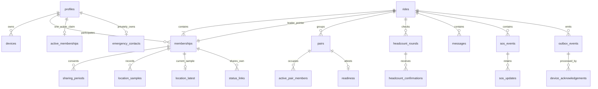

# Database model

[schema.sql](schema.sql) is a PostgreSQL reference DDL for an empty disposable database. It fixes field names, relationships and basic integrity boundaries. It is not the deployed migration set and does not implement the service transactions, authorization or purge workers. [Access/lifecycle rules](access-and-lifecycle.md) specify those obligations.

## Relationships

The leader relationship is a pointer to exactly one membership, not a second user or a separate physical role. The API returns `leader` when `rides.leader_member_id` matches the membership; otherwise it returns `physical_role` (`rider`/`pillion`). A transaction validates that the pointed membership is current and physically a rider. The deferred composite FK permits a ride and its initial membership to be inserted in one transaction and rejects a leader from another ride at commit.

## Data dictionary

| Table | Purpose and main boundary |
|---|---|
| `profiles`, `devices` | Auth-subject UUID, display name/account block, owned device and encrypted push token; no password storage |
| `rides` | Lifecycle, unique leader pointer, transport, revisions and configurable thresholds; server timestamps |
| `memberships` | Participation interval and physical role; sharing off initially; current membership unique per account/ride |
| `active_memberships` | Account primary key prevents simultaneous active claims, independent of sharing state |
| `invitations` | Hashes of link token and short code; rotation/expiry on each use; short codes also need rate limiting and server-keyed hashing |
| `consent_requests` | Pair, role and leadership proposals with counterpart acceptance, expiry and one-use pairing challenge |
| `pairs`, `active_pair_members` | Historical rider/pillion association and member occupancy; member primary key prevents occupancy in two pairs |
| `readiness` | One current attestation per pair, attributed to its pillion; invalidated on pair/role change |
| `headcount_rounds`, `headcount_confirmations` | Round captures pairing revision; one scan per round/pair; never reuse old round results |
| `scan_challenges`, `scan_receipts` | Five-minute hashed QR challenge tied to pair/optional round; unique consumption and actual scanner; readiness/headcount reference fresh receipts |
| `sharing_periods` | Granted capture intervals per membership and consent epoch; stop and re-enable remain separate epochs |
| `routes` | Current planned route/profile/revision; points validated by API; no active-ride editing |
| `location_samples`, `location_latest` | Immutable sample identity, capture/receipt times and separate person trail; latest is an authorized monotonic projection |
| `messages`, `media_assets` | Text/preset/pin/voice variants; media ownership, quarantine, bounds and private storage key |
| `sos_events`, `sos_updates` | Immutable request/reporter/device and pairing/location snapshot; attributed okay or coordination closure never erases request |
| `status_links` | Owner membership, token hash, bounded chosen lifetime/revocation; no raw recoverable bearer |
| `emergency_contacts` | One encrypted private contact per owner; encryption key lives outside the database |
| `command_receipts` | Actor + stable command ID + canonical request hash; metadata-only retry outcomes, no raw links/contacts |
| `outbox_events`, `device_acknowledgements` | Durable event per ride sequence and actual per-device processing acknowledgement |
| `deletion_jobs` | Immediate account block followed by retryable 7-day active-store / 30-day backup deadlines |
| `ad_entitlements` | Server-provisioned ad-free test entitlement; no checkout/reward implementation |

UUIDs are supplied by the application, allowing local event/command IDs before connectivity. Times use `timestamptz` and UTC on the wire. Wire `lat`/`lon` have named fields; GeoJSON/OSRM conversion deliberately uses longitude first. Missing speed/heading is null, not zero.

Wire-to-database adapters are explicit: `speedKph / 3.6` becomes `speed_mps`; `recordedAt` becomes `captured_at`; a user-confirmed `possible_crash` request becomes source `possible_crash_user_requested`. A planned route's wire ID is its `ride_id`. A QR pair invitation is a `consent_requests` row with issuer consent and a null target until the scanning counterpart accepts; acceptance binds a distinct target before commit. Profile/contact/pair/round revisions support optimistic edits. Battery readings are transient event input; warning state uses durable events/receipts rather than an unrelated profile-location record.

The portable DDL uses finite checked scalar coordinates so it can be verified without installing a spatial extension. Day 4 must validate PostGIS on the chosen database and add generated geography/geometry and GiST indexes where queries need them. This is not a decision to drop PostGIS. It avoids claiming an extension was tested when it was not. Profile/auth foreign keys are represented locally by the verified Auth UUID and account provisioning flow, not a dependency on a Supabase-owned schema in a standalone test.

## Integrity: database versus service

| Invariant | Reference database enforces | Required service enforcement |
|---|---|---|
| One leader in own ride | Non-null single pointer, composite deferred FK | Current rider membership, allowed accepted transfer, no authority after deletion |
| One active ride | Unique account claim and membership/account/ride FK | Create/remove every claim atomically with start/join/leave/end; don't insert claims for lobby rides |
| At most 50 current people | Current membership uniqueness | Ride-row lock and count before join; pillions included; rollback entire failing command |
| One motorcycle pair per person | Distinct members, same-ride FKs, unique open rider/pillion, occupancy PK | Exactly two valid claims; physical roles/transport and both consent; invalidate on leave/role/end |
| Own readiness / fresh headcount | Pair/round identities, distinct round/pair key | Pillion actor attests; current pair set/revision; stationary scanner/leader; no offline completion |
| Valid location | Coordinate/finite value bounds, owned device FK, consent interval FK | Active authorization, current epoch, capture interval, clock/freshness checks and monotonic latest write |
| Safe message/media | Variant constraints, text/photo/voice size bounds, same-ride FK | Preset allowlist, movement, MIME/decoder verification, owner/kind match, EXIF stripping, object privacy |
| SOS | Same-ride reporter/device and durable IDs | One-tap flow, 60-second reconciliation/reconfirmation, server-derived snapshots, reporter-only okay / leader-only closure |
| Link privacy | Hash size/uniqueness, permitted lifetime range, owner in ride | Secure randomness, current authorization/expiry per read, allowlisted projection and 15-second lease |
| Deduplication | Actor/command and event/sequence uniqueness | Canonical hash match, record outcome + domain change + outbox in same transaction, no secret payloads |
| Retention / deletion | Deletion job deadline upper bounds | Stamp expiry on end, read-time denial, object deletion, purge/anonymization and restore tombstones |

JSON fields are intentionally limited to variable route points, consent/event snapshots and receipt metadata. SQL checks their outer type; API schemas and domain validation check the content. They are not a way around authorization. In particular, a client cannot supply another person's SOS pairing snapshot or arbitrary event type.

## Transaction sketches

**Create:** allocate ride/member UUIDs; insert lobby with leader pointer; insert rider membership; create invitation; record metadata-only command receipt/outbox; commit the deferred leader FK. Invalid input or FK failure leaves no partial ride.

**Start and active join:** use the lock order in the lifecycle document; verify current leader, invitation/readiness/cap as applicable. Insert unique active claims for every participant of a starting ride, or the joining person of an active ride. Update lifecycle/membership revision and event sequence; insert outbox and receipt; commit. If any account already has another active claim, roll back the whole operation. A valid lobby membership alone never starts GPS.

**Pair:** after a separate counterpart acceptance, lock and revalidate proposal, two current members and motorcycle roles. Insert pair and both occupancy claims atomically; consume the proposal; increment `pairing_revision`; invalidate related readiness. There is no partial pair if either claim conflicts. Unpair closes the historical row, deletes both occupancy claims and invalidates readiness. It never deletes either person's sample history.

**Headcount:** opening stores the current pairing revision. Scan validation binds the round and current pair in the same ride; the primary key makes duplicate scans harmless. Completion compares the current pair set and revision under lock. A changed pair set requires refreshing the round/affected confirmations; do not silently count a departed pair instead of its replacement.

Scan issuance, consumption and receipt use the same pair/round locks. Check scanner role and that challenge, receipt and attestation/confirmation all identify the same current pair and round; the reference FKs alone do not enforce every match. Only the pillion submits initial helmet/readiness attestation. Rest-stop completion requires fresh leader scans, without a new helmet attestation requirement at every stop.

**Accept sample:** authenticate device/member; validate interval/epoch and capture time; deduplicate by sample ID with an identical-payload check. Append the sample. For the live path only, compare `(captured_at, id)` with the existing latest sample while holding the membership/latest lock; update only if newer. History replay never writes latest. Atomically emit accepted state only where authorized. Freshness uses capture age/accuracy, not receipt time.

**End/stop:** stopping closes the consent interval using reconciled stop time, increments epoch, hides latest live projection and revokes links while preserving active membership. End does that for all current members, sets authoritative end time, clears claims/pairs, assigns 90-day expiry to retained ride data and records one end event. Historical upload can accept only valid samples inside an earlier grant and before stop/leave/end; it cannot reopen the ride.

**Durable delivery:** a committed change and outbox share a transaction. Worker publishes with stable event ID; publish success only marks its attempt and is not recipient acknowledgement. A recipient validates the event and records an acknowledgement for its own device. A duplicate delivery is safe. Authorization is checked again before emission/replay, so an old room subscription does not outlive membership.

## Read paths, retention and sizing

Read member state by ride, own history by `(user_id, joined_at, id)`, messages by `(ride_id, accepted_at, id)`, trails by `(membership_id, captured_at, id)`, and durable replay by `(ride_id, sequence)`. Use bounded keyset pagination. The outbox partial index serves unsent events; expired samples use a retention index. Additional indexes/partitions require measured query plans on Day 28, not speculation.

Summaries are a derived read model computed from individual samples and participation intervals; no stored aggregate is required in the reference schema. Recompute idempotently after eligible late history/deletion, include stops in elapsed duration, show gaps/unavailable pace, and never sum group distance as a person's distance. If materialized later, its lifetime/deletion follows the source samples.

On end set related personal-data expiry to `ended_at + 90 days`. Read-time checks apply before the scheduled sweep runs. Receipt/outbox payloads can duplicate personal data, so their copies and acknowledgement dependencies must be purged too; identity-only tombstones must not retain precise locations. Keep command tombstones through the maximum 24-hour client replay window and the ride's retention horizon; an expired event lookup requires snapshot/reconciliation, never blind resend.

Deletion uses explicit dependency order, not broad cascading deletes that might remove others' content. Delete object bytes and own contributions, remove their projections/receipts, redact snapshots/display names, and leave anonymized membership/profile identities only where shared records require FKs. Track active-store completion independently of backup expiry. A restore must apply deletion tombstones before accepting traffic. Actual provider backups/worker execution remain implementation and release checks.
